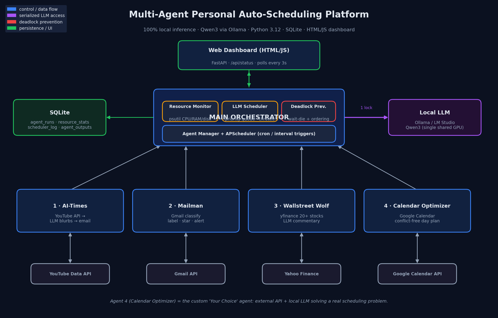

# 🧠 Multi-Agent Personal Auto-Scheduling Platform

A fully local, multi-agent automation platform. A central **orchestrator** manages five
specialized agents, schedules access to a **locally hosted LLM (Qwen3 via Ollama)**,
monitors system resources, prevents deadlocks, and serves a live web dashboard.

> **Every AI inference runs on your machine.** There are no hosted-LLM API calls anywhere
> in this codebase — the only model client talks to `http://localhost:11434` (Ollama).



---

## Table of contents
1. [Features](#features)
2. [The five agents](#the-five-agents)
3. [How the orchestrator works](#how-the-orchestrator-works)
4. [Tech stack](#tech-stack)
5. [Prerequisites](#prerequisites)
6. [Setup](#setup)
7. [Running the platform](#running-the-platform)
8. [The dashboard](#the-dashboard)
9. [Project structure](#project-structure)
10. [Testing](#testing)
11. [Configuration reference](#configuration-reference)
12. [Troubleshooting](#troubleshooting)
13. [Assignment requirement checklist](#assignment-requirement-checklist)

---

## Features
- **Central orchestrator** that registers agents, wires their schedules, and exposes one live status snapshot.
- **Local LLM scheduling** — a single shared model is serialized through a priority queue with throttling.
- **Deadlock prevention** — canonical lock ordering + the **wait–die** protocol guarantee the agent/resource graph can never cycle.
- **Resource monitoring** — `psutil` samples CPU/RAM/disk every 3 seconds; jobs are throttled when the machine is busy.
- **Graceful degradation** — if the LLM, Google credentials, or API keys are missing, agents fall back to demo data and emails are written to a local outbox, so the whole platform runs end-to-end for a demo.
- **Live HTML/JS dashboard** — resource gauges, scheduler queue + held locks, per-agent cards with a "Run now" button, and scrolling logs.
- **SQLite persistence** — every run, schedule event, resource sample, and agent output is stored and surfaced on the dashboard.

---

## The five agents

| # | Agent | What it does | External API | Local LLM use |
|---|-------|--------------|--------------|---------------|
| 1 | **Main Orchestrator** | Manages all agents; monitors CPU/RAM/disk; schedules LLM access; prevents deadlocks | — | Allocates the model |
| 2 | **AI-Times** | Fetches the latest AI YouTube videos and emails a daily HTML digest | YouTube Data API v3 | One-line "why it matters" per video |
| 3 | **Mailman** | Monitors the Gmail inbox, classifies unread mail, labels + stars + alerts | Gmail API | Classifies each email into 7 categories |
| 4 | **Wallstreet Wolf** | Tracks 20+ stocks and emails a daily market report | Yahoo Finance (`yfinance`) | Writes market commentary |
| 5 | **Calendar Optimizer** *(custom "Your Choice")* | Reads today's calendar, finds conflicts/gaps, and proposes an optimized, conflict-free day plan | Google Calendar API | Generates the optimized plan |

**Why Calendar Optimizer?** People start the day with overlapping meetings, no focus time, and
deadlines scattered around. This agent detects conflicts deterministically, then asks the local
LLM to produce a plan that resolves overlaps, inserts buffers, and protects a 90-minute deep-work block.

---

## How the orchestrator works

### LLM scheduling
The local model is a **single shared resource** — only one inference may run at a time. Agents are
dispatched by cron/interval triggers into a **priority queue** (lower number = higher priority, so
`Mailman` at priority 3 preempts `AI-Times` at priority 6). A small worker pool pulls jobs, and before
each job runs the scheduler:
1. **Throttles** while CPU ≥ 85% or RAM ≥ 90% (configurable), logging a `throttled` event.
2. **Acquires every resource the job needs atomically** (the `llm` lock plus any API lock such as `gmail`).
3. Runs the job under a **watchdog timeout** so a wedged inference can't hold the lock forever.

### Deadlock prevention
Multiple workers needing multiple named locks can deadlock through *circular wait*. Two complementary
techniques make that impossible:

- **Canonical lock ordering** — a job acquires all its resources in one atomic, sorted step, removing
  inconsistent hold-and-wait ordering.
- **Wait–die** — every job carries a monotonically increasing transaction id (older = smaller). When a
  job wants a lock held by another job: if the requester is **older it waits**; if it is **younger it dies**
  (aborts and is re-queued). Because only older transactions ever block, the wait-for graph can never
  contain a cycle.

Both are implemented in `orchestrator/scheduler.py` and covered by unit tests in `tests/test_scheduler.py`.

---

## Tech stack
- **Backend:** Python 3.12, FastAPI + Uvicorn
- **Local LLM:** Ollama serving **Qwen3** (`qwen3:8b` by default)
- **Frontend:** plain HTML + CSS + vanilla JavaScript (no build step)
- **Storage:** SQLite
- **Scheduling:** APScheduler (cron/interval) + a custom priority scheduler
- **Monitoring:** psutil
- **APIs:** YouTube Data API, Gmail API, Google Calendar API, Yahoo Finance

---

## Prerequisites
- **Python 3.12+**
- **Ollama** (or LM Studio with an OpenAI-compatible `/api` shim) — https://ollama.com
- A **Google Cloud project** (only if you want live Gmail / Calendar / YouTube; otherwise demo mode runs without it)
- A **Gmail App Password** for outbound email (optional; otherwise emails are saved to `data/outbox/`)

---

## Setup

### 1. Clone and create a virtual environment
```bash
git clone https://github.com/<your-username>/multi-agent-auto-scheduler.git
cd multi-agent-auto-scheduler/auto-scheduler

python3.12 -m venv .venv
# Windows:  .venv\Scripts\activate
# macOS/Linux:
source .venv/bin/activate

pip install -r requirements.txt
```

### 2. Install and start the local LLM
```bash
# Install Ollama from https://ollama.com, then:
ollama serve            # starts the local server on :11434
ollama pull qwen3:8b    # or qwen3:4b on lower-spec machines
```

### 3. Configure environment
```bash
cp .env.example .env
# Open .env and fill in what you have. Everything is optional —
# missing values just put the relevant agent into demo mode.
```

### 4. (Optional) Google credentials for Gmail + Calendar
1. Go to https://console.cloud.google.com → create a project.
2. Enable **Gmail API**, **Google Calendar API**, and **YouTube Data API v3**.
3. Create an **OAuth client ID** of type *Desktop app*; download the JSON.
4. Save it as `credentials/google_client_secret.json` (path configurable in `.env`).
5. For YouTube, create an **API key** and put it in `YOUTUBE_API_KEY`.

The first time a Google agent runs it opens a browser for consent; the token is cached to
`credentials/google_token.json` afterward.

### 5. (Optional) Outbound email
Set `SMTP_USERNAME` / `SMTP_PASSWORD` (a Gmail App Password) in `.env`. Without these, every
digest email is written to `data/outbox/*.html` instead of being sent.

---

## Running the platform

```bash
# Self-check (verifies LLM reachability, DB, config)
python run.py --check

# Run a single agent once (great for debugging)
python run.py --agent Calendar-Optimizer
python run.py --agent Mailman

# Start the orchestrator + dashboard (default)
python run.py
```

Then open **http://127.0.0.1:8000**.

Agents run automatically on their schedules (configurable in `.env`):
`AI-Times` 08:00, `Mailman` every 15 min, `Wallstreet-Wolf` 17:30, `Calendar-Optimizer` 07:00.
You can also trigger any agent instantly from the dashboard's **Run now** button.

---

## The dashboard
- **Resource gauges** — live CPU / RAM / disk with throttle thresholds; turns amber/red under load.
- **Throttle banner** — appears when the scheduler is deferring LLM jobs.
- **Scheduler panel** — queued count, currently active agents, worker count, and **which locks are held**.
- **Agent cards** — status dot, priority, locks, last result, and a **Run now** button.
- **Logs** — scheduler activity (`queued / started / throttled / deadlock_avoided / finished`) and recent runs.
- **Outputs** — latest structured results (classified emails, top movers, optimized plans).

The page is plain HTML/JS and polls `/api/*` every 3 seconds.

---

## Project structure
```
auto-scheduler/
├── run.py                     # entry point (--check / --agent / serve)
├── config.py                  # all settings, loaded from .env
├── requirements.txt
├── .env.example
├── core/
│   ├── llm.py                 # Ollama client (LOCAL ONLY) — generate/classify/json
│   ├── database.py            # SQLite layer (thread-safe)
│   └── emailer.py             # SMTP HTML email + local outbox fallback
├── orchestrator/
│   ├── orchestrator.py        # agent manager + APScheduler triggers + status()
│   ├── resource_monitor.py    # psutil CPU/RAM/disk monitor + throttle decision
│   └── scheduler.py           # priority queue + wait-die deadlock prevention
├── agents/
│   ├── base_agent.py          # run lifecycle, timing, persistence
│   ├── ai_times.py            # YouTube digest
│   ├── mailman.py             # Gmail classify/label/star/alert
│   ├── wallstreet_wolf.py     # yfinance + LLM commentary
│   ├── calendar_optimizer.py  # custom agent
│   └── google_auth.py         # shared Gmail/Calendar OAuth helper
├── web/
│   ├── server.py              # FastAPI app + REST API
│   └── static/                # index.html, style.css, app.js
├── docs/
│   ├── architecture.png       # architecture diagram
│   └── make_architecture.py   # regenerates the diagram
├── tests/
│   └── test_scheduler.py      # deadlock-prevention unit tests
└── data/                      # SQLite db + email outbox (gitignored)
```

---

## Testing
```bash
pytest -q
```
The suite verifies the deadlock-prevention core: canonical ordering for disjoint resources,
wait–die abort for younger transactions, wait-then-acquire for older transactions, and a
contention stress test proving two agents competing for the same two locks always complete
without hanging.

---

## Configuration reference
See `.env.example` for the full list. Key values:

| Variable | Default | Meaning |
|----------|---------|---------|
| `OLLAMA_MODEL` | `qwen3:8b` | Local model name |
| `CPU_THROTTLE_PERCENT` | `85` | Defer LLM jobs above this CPU % |
| `RAM_THROTTLE_PERCENT` | `90` | Defer LLM jobs above this RAM % |
| `LLM_LOCK_TIMEOUT_SECONDS` | `180` | Watchdog before a held lock is force-released |
| `STOCK_TICKERS` | 22 tickers | Wallstreet Wolf watchlist (≥ 20) |
| `MAILMAN_INTERVAL_MINUTES` | `15` | Mailman poll cadence |

---

## Troubleshooting
- **"LLM offline" on the dashboard** → run `ollama serve` and `ollama pull qwen3:8b`; check `OLLAMA_BASE_URL`.
- **Emails not arriving** → confirm `SMTP_*` values; otherwise look in `data/outbox/`.
- **Google consent loop** → delete `credentials/google_token.json` and re-run the agent.
- **`yfinance` empty results** → Yahoo occasionally rate-limits; re-run later.
- **High CPU pauses jobs** → that's the throttle working; lower thresholds in `.env` if undesired.

---

## Assignment requirement checklist
- ✅ Central orchestrator managing five specialized agents
- ✅ Resource scheduling (priority queue) + deadlock prevention (wait–die + ordering)
- ✅ CPU / RAM / disk monitoring (psutil)
- ✅ All AI inference **local** (Ollama / Qwen3) — no hosted LLM APIs
- ✅ Python 3.12 backend, plain HTML/JS frontend
- ✅ SQLite storage
- ✅ Web-based dashboard
- ✅ Five agents: Orchestrator, AI-Times, Mailman, Wallstreet Wolf, Calendar Optimizer (custom)
- ✅ README with full setup, architecture diagram (PNG), demo script (`DEMO_SCRIPT.md`)

---

*Built for a local-first, privacy-preserving automation assignment. Not investment, legal, or
medical advice.*
